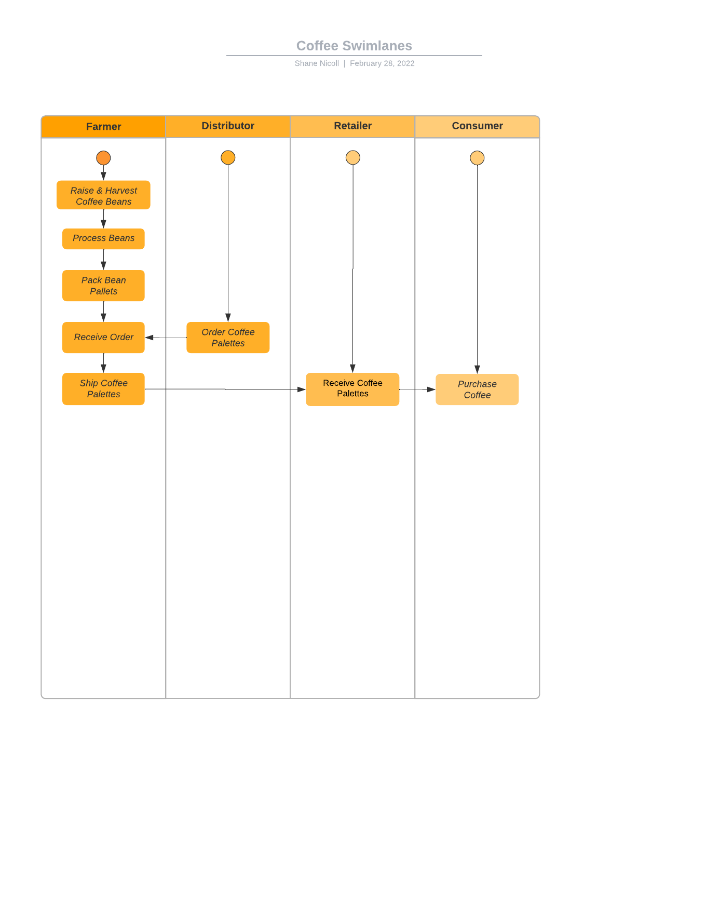
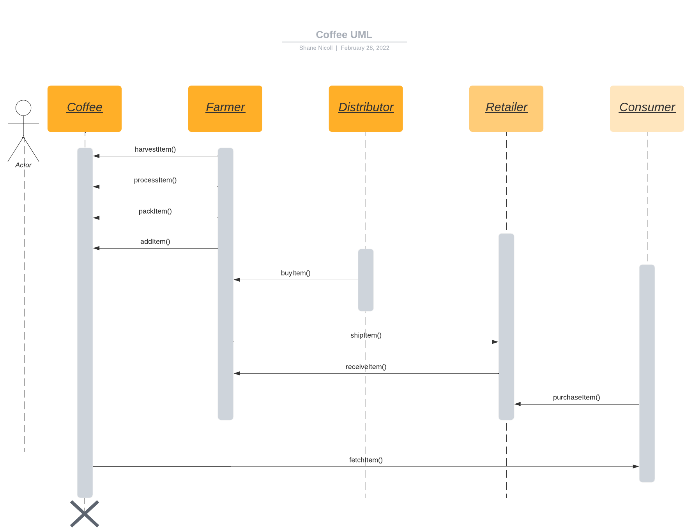
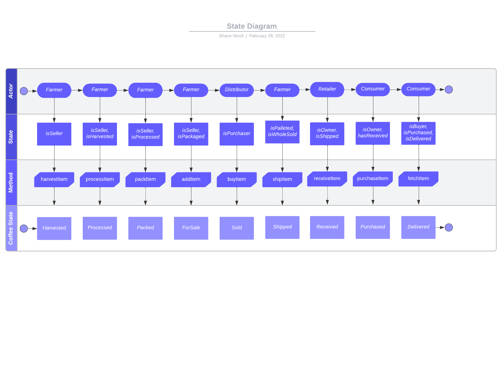
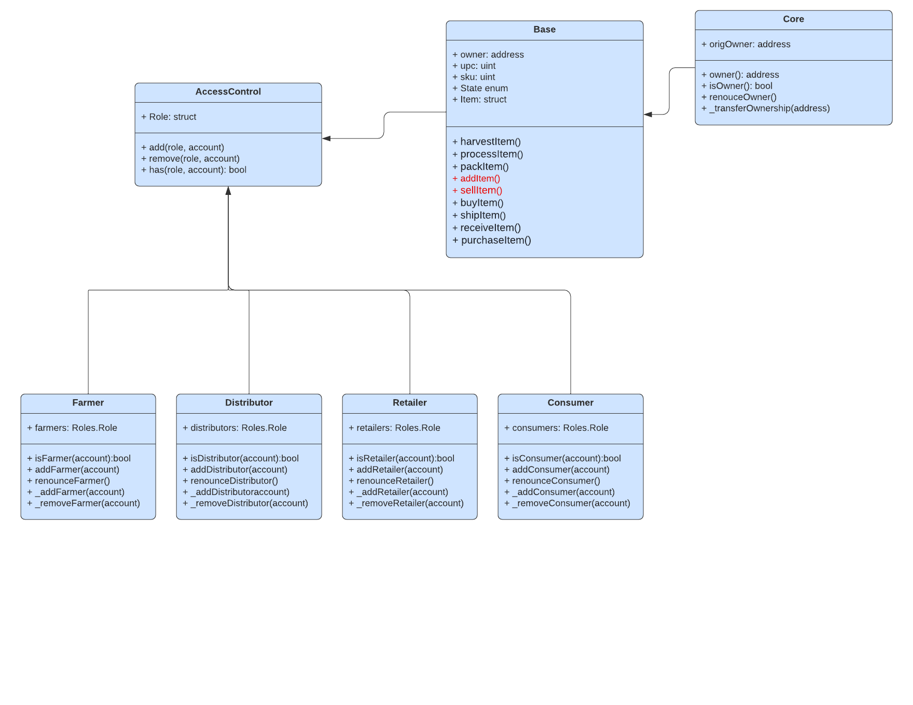

# Coffee Supply chain -  From the plant to your cup

This repository contains a simple process of a supply chain process where the farmer can track their product from harvest, to packed, and sold, shipped and delivered to a retailer so a consumer can buy it.

The DApp User Interface uses a simple web front end webpage, and interfaces with Ganache, the gui version, and allows the user to see the process, ownership, etc.

## Project Write Up - UML

Please see the following diagrams for the Supply Chain process.



n







## Getting Started

To get started, download the repository, install the prerequisites, and then you should be able to test.

### Prerequisites

Please make sure you've already installed ganache-gui, Truffle and enabled MetaMask extension in your browser.

### Installing

> The starter code is written for **Solidity v0.4.24**.  To use this project, please run `npm i -g truffle@4.1.14` to install Truffle v4 with Solidity v0.4.24. 

A step by step series of examples that tell you have to get a development env running

Clone this repository:

```
git clone https://github.com/udacity/nd1309/tree/master/course-5/project-6
```

Change directory to ```project-6``` folder and install all requisite npm packages (as listed in ```package.json```):

```
cd project-6
npm install
```

Launch Ganache Gui:

In a separate terminal window, Compile smart contracts:

```
truffle compile
```

This will create the smart contract artifacts in folder ```build\contracts```.

Migrate smart contracts to the locally running blockchain, ganache-cli:

```
truffle migrate --reset
```

Test smart contracts:

```
truffle test
```

All 20 tests should pass.


In a separate terminal window, launch the DApp:

```
npm run dev
```

## Contract Address on Etherscan for the submitted contract

* Contract Address in Etherscan:
0xc5fbcCAeE3C21BED491d13c068fAeD54B59359FC
[https://rinkeby.etherscan.io/address/0xc5fbccaee3c21bed491d13c068faed54b59359fc]()

* Transaction Hash:
0x3dbe6e956062222414ec0eb08ee9f7efeb876f3bb037dbc4df54613d3da55a23
[https://rinkeby.etherscan.io/tx/0x3dbe6e956062222414ec0eb08ee9f7efeb876f3bb037dbc4df54613d3da55a23]()

## Built With

* [Ethereum](https://www.ethereum.org/) - Ethereum is a decentralized platform that runs smart contracts
to make the web faster, safer, and more open.
* [Truffle Framework](http://truffleframework.com/) - Truffle is the most popular development framework for Ethereum with a mission to make your life a whole lot easier.


## Authors

Udacity wrote the template for the project, Shane Nicoll completed this project.

## Acknowledgments

* Solidity
* Ganache-GUI
* Truffle
